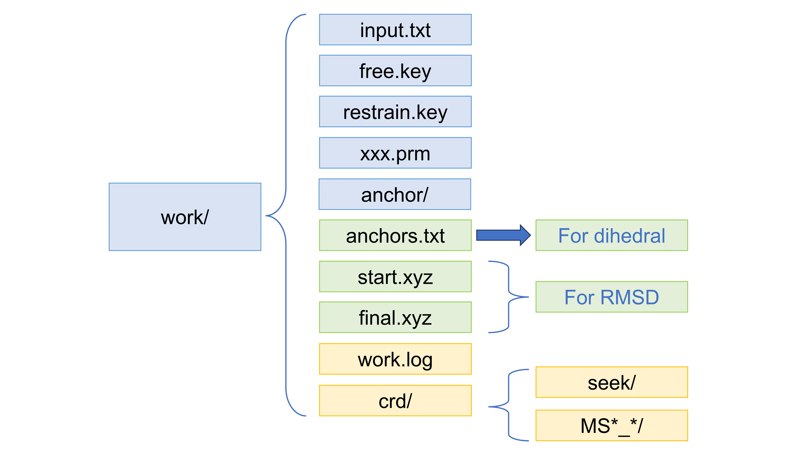
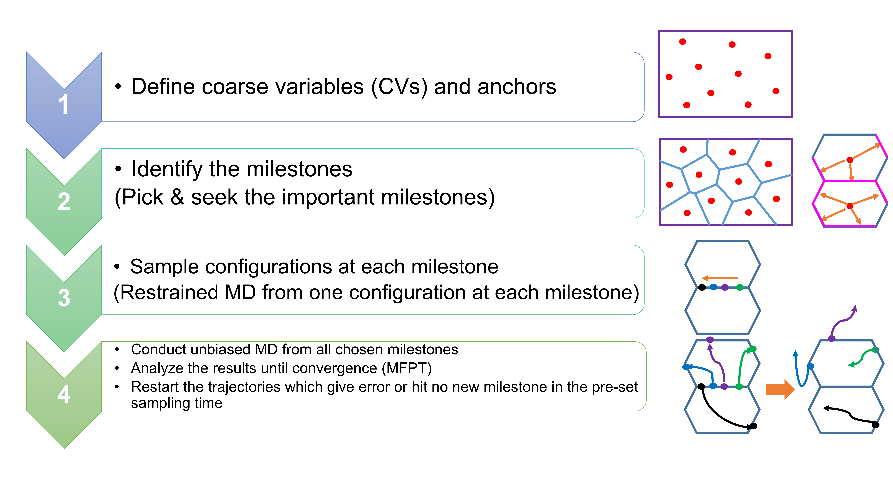

# Tinker_Milestoning Program

This program is developed for performing Milestoning method with Tinker MD Software, which supports AMOEBA force field. The Milestoning method requires coarse variables (CV) to describe the energy landscape and define different states, and current available types of CV are dihedral and RMSD.

## Environment setting and required softwares

Tinker9_GPU: https://github.com/TinkerTools/tinker9

Tinker8_CPU: version > 8.9.4

(please follow the environment requirements mentioned in README of Tinker9 Github SIte)

LOOS: https://github.com/GrossfieldLab/loos version > 4.0.4

numpy 1.22.3

sympy 1.11.1

openbabel 3.1.1

## Directory Structure

The blue boxes denote the essential files or folders for all CV cases. 

The green boxes show those files only used for one CV case: anchors.txt is only utilized when dihedral is the CV while start.xyz and final.xyz only exist in the case of RMSD. 

The orange boxes illustrate those files and folders automatically generated after the program starts working. 

We have provided 3 examples: alanine dipeptide, DNA_1D42, RNA_2JXQ with initial setting.

## Working procedure

* Step 1: Determine appropriate coarse variables (CV)

* Step 2: Seek the Milestones (MS)

The program has a seek module to identify those MSs starting from pre-determined configurations as described below (with dihedral or RMSD as CV). In this step, all the MD jobs are unrestrained.

In the case of dihedral, users provide the 4-atom indices for the specific dihedral angle in the input file (``work/input.txt``). At the same time, an additional file, ``work/anchors.txt``, contains the dihedral angle values (between -180.0 and 180°) of those pre-selected configurations in the directory ``work/anchors/``. For example, a structure is selected every 30 degrees along the ψ angle for a dipeptide. After the seek process is started, a new folder called ``work/crd/`` is created, and all the files related to the seek process are placed into ``work/crd/seek``. The program will automatically calculate the positions of MS based on the anchor configuration (``work/anchors.txt``), and subsequently determine if an MD trajectory reaches a new MS. LOOS program is applied to calculate the change of dihedral during the MD jobs. All the newly found configurations at each MS are extracted from the trajectory files and put into the new directories in the format MS*_*, where “*” denotes the index of the neighbor anchor) inside `work/crd/`. Because it usually takes a couple of runs to find configurations at important MS, this module can operate multiple seek processes from the same starting configurations with different velocities. Users can specify the number of repetitions for the seek module in `work/input.txt`.

In the case of RMSD, coordinates of pre-determined configurations in `work/anchors/` are generated by averaging the coordinates of two reference states (e.g. 10%A+90%B,…,50%A+50%B,…,90%A+10%B). In the DNA/RNA cases, we used ~20 structures uniformly distributed between A and B conformations. Generally speaking, they do not need to be the true anchors or uniformly distributed along the CV connecting the reactant state and the product state in this case. The reason is that it is difficult to directly generate the exact anchor configurations. Those averaged configurations are simpler to obtain and the seek module can discover possible MSs in neighbor from any point on a 2D landscape. If there is a large region with a flat energy landscape, we can add more configurations to this region to cover as much area as possible (diffusion problem). In this case, `work/anchors.txt` is no longer necessary. Users will provide the RMSD value between the reactant and the product reference states and the starting and ending atom index in coordinate files for RMSD calculation in `work/input.txt`. Meanwhile, users must provide the coordinates of the reactant (`work/start.xyz`) and the product (`work/final.xyz`) so the program can use LOOS to calculate the RMSD. The user-specified spacing and RMSD between the two reference states are used to calculate the position of anchors, which are used next to determine MS from MD simulations. The other settings and procedures are the same as those in the case of dihedral.

* Step 3: Sample and generate the initial set of configurations for each MS

The program will sample different MS to obtain a set of initial configurations. Those configurations are generated by a single restrained MD starting from one random point on each MS (`work/restrain.key`). In our work, those starting points come from the configurations in the second step. The equilibration time, time interval, and the number of configurations on each MS should be set in the input file (`work/input.txt`). All the coordinate files and corresponding key files can be automatically generated inside the different MS*_* folders.

* Step 4: Production Step

The program conducts the unrestrained MD from all the configurations of the chosen MS. This step requires parallelization of jobs to accelerate the simulations (GPU-based). Each MD job produces one short trajectory starting from one MS, and the program waits for it to reach a new MS to complete the job. The input file (`work/input.txt`) sets the running time of a single MD job. When the MD completes the pre-set period, the program will read and analyze the trajectory file to check if it hits a new MS. If true, the program will record the total running time between the two MS, the starting MS index, and the new MS index. At the same time, the snapshot of the reaching point will be extracted as the starting configuration for the next iteration. The recorded time is used to calculate the lifetime of each MS, and the MS indices are necessary to count the number of state changes for the transition matrix. If no new MS is hit, the program will restart this simulation using the final coordinates and trajectories. When all the configurations arrive at the new MS, one iteration of Milestoning is completed. At this time, the program begins the post-analysis to evaluate the transition matrix, free energy list, and MFPT. The MFPT value is usually used as the index to check the convergence of iterations right now. Other relevant properties can also become the criteria of convergence. If the MFPT does not converge, which means that the MFPT difference is greater than the user-set tolerance, the program will restart the iteration by using the coordinates where the last iteration of MD jobs stops. The restart process assigns new velocities for every MD simulation at the beginning of each iteration. Also, users can set the maximum of configurations on each MS in work/input.txt, then the program can check whether the number of configurations will exceed the maximum before doubling the configurations. The maximum is the same as the initial number of configurations in default when no relevant keyword is given in the input file.

## Input Setting
input.txt records the input setting to lead the whole job, and here are the meanings of all the important commands and keywords:

`path_jobsubmit`  : The path of submission directory, which contains all the generated GPU MD job .sh files for parallelized submission
path_tinker  : The path of directory including Tinker executives: analyze9.x, minimize9.x, dynamic9.x
initial_iteration  : The starting iteration index (commonly, we starts from 1)
max_iteration  : The maximum number of iterations
milestoneSearch  : Two options: 0 or 1, 0 means the Seek step is skipped (the MS configurations already exist in crd/ directory), and 1 means the Seek Step is included.
time_step  : The time step of MD jobs (unit: fs, default = 2.0)
seek_traj  : The number of trajectories starting from each anchor in Seek Step (default: 0) 
seek_time  : The total time of each Seek MD jobs (unit: ns, default: 1.0)
seek_save_frequency  : The save frequency of Seek Step (unit: ns, default: 0.01) 
restrain_md_time  : The total restrained MD time in Step 3 (generating new configurations on each MS) (unit: ns, default: 1.0)
restrain_eq_time  : The equilibration time in restrained MD jobs (the snapshots recorded in this time scope will be ignored and the configurations are picked up from the rest) (unit: ns, default: 0.5)
interval  : The interval between two snapshots chosen for configurations of each MS in Step 3
traj_per_launch  : The number of trajectories to launch for each MS in each iteration (default: 100)
sampling_time  : The sampling time for a single MD job in Production Step (unit: ps, default: 100.0)
save_frequency  : The save frequency of MD jobs in Production Step (unit: ns, default: 0.01)
max_traj_per_launch  : The maximum of trajectories for each MS during the iterations
max_md_time  : The maximum time limit of each MS job (one MD job may restart from the last coordinates for many times, the program will record all the time consumed by any single job and make sure it will not exceed this upper limit.) (unit: ns, default: 10.0)
anchorsNum  : The number of anchor coordinate files (tinker xyz) given in anchors/ directory
restrain_type  : The type of coarse variables (dihedral or RMSD) 
(format: dihedral a b c d (a,b,c,d are the atom id defining the dihedral); RMSD A B C (A: RMSD between reactant and product, in Angstrom; B: divide the value of RMSD A into B parts; C: the first C atoms will be used to calculate the RMSD)
forcefield  : The forcefield file .prm
skip_restrain  : Turn off Step 3 when written in input.txt
reactant  : The name of MS denoting reactant state (format: A,B  A and B are 2 neighbor anchor indices)
product  : The name of MS denoting reactant state (format: A,B  A and B are 2 neighbor anchor indices)
pbc  : The periodic boundary (format: A,B  A and B are the same MS in periodic condition)
milestone_threshold:  The threshold to tell if one trajectory has already hit one MS (unit for dihedral: degree; unit for RMSD: Angstrom)
ensemble  : MD ensemble (2 options: NVT or NPT)
temperature  : MD Temperature
pressure  : MD Pressure
tolerance  : Convergence check by using MFPT value
force_const  : The harmonic force constant used in restrained MD (Step 3)
